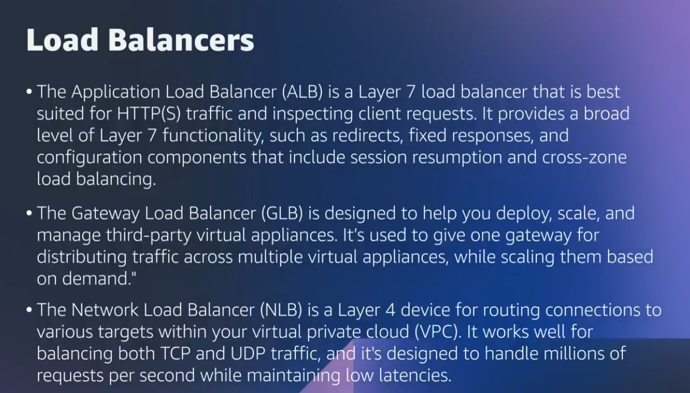

# Coursera: Migrating to the AWS Cloud: Migration Hub

See https://www.coursera.org/learn/aws-fundamentals-migrating-to-the-cloud/lecture/fDa3e/migration-hub-deep-dive

## Migration Hub Deep Dive

How does Migration Hub help you discover resources so you can gather all of the information on your servers? 

With **Migration Hub import**, you can import information about your on-premises servers and applications into Migration Hub. This will include server specs and utilization data.

This data is uploaded in CSV format. It can be collected manually, or it can be collected with:

* **Migration Evaluation Collector**
* **AWS Agentless Discovery Connector**: This is great for VMware environments. It is installed as a VM in your VMware vCenter server environment, using an OVA file.
* **AWS Application Discovery Agent**: Great for other types of servers or VMs. It collects system configuration times, series utilization, performance data, process data, and TCP network connections.

## Translating Into AWS Services

When looking at **services**, not all services will have a direct translation into AWS. For those that are more direct, most of what you need to learn is the name of the service that you'll be using. And for those that are a bit less direct, you need to understand the functionality before looking into the service or feature that will meet that requirement.

When looking at **infrastructure**, servers directly translate to Amazon EC2 instances. This service provides secure and resizable compute capacity in the cloud. As a result, understanding EC2 will help understand how your services will translate.

It is also important to understand the **load balancers** that AWS makes available. There is the Application Load Balancer (ALB), Gateway Load Balancer (GLB), and Network Load Balancer (NLB).

Another area for consideration when migrating is **databases**. One option is to migrate your existing DBMS onto EC2 instances. Alternatively, you can utilize a managed solution like Amazon RDS.

## Translating Networking Services to AWS

The first step is to create a map of network infrastructure.

One important consideration is that we want to choose AWS IP ranges that does not conflict with our on-premise ranges.

We will want to split up our resources into public and private subnets. Most of the resources will likely be in the private subnets.

Then we need to create the connection between our AWS networks and the public internet. The **NAT gateway** is responsible for exposing that interface, and it will sit within the public subnet.

We will also likely want to distribute traffic between the various availability zones. For that, we will use an **elastic load balancer** (ELB) that sits outside of the availability zones.

How do we create a connection between our on-premise datacenter and our AWS VPC? We would create a **VPN connection** between the two.

What if the traffic is too much for a VPN connection? If that's the case, then **Direct Connect** will offer that necessary bandwidth. Direct Connect is run through AWS's partners, and it gives you a private fiber run directly into the AWS backbone. Speeds go from 50 Mbps to 10 Gbps. This is useful for long-term migrations or hybrid setups.

If you're looking to quickly transmit data in a one-time fashion from your data center to the cloud, you'll probably want to avoid using Direct Connect. Instead, it would be worth considering Data Sync and the Snow Family.

## Next

https://www.coursera.org/learn/aws-fundamentals-migrating-to-the-cloud/lecture/Q95VF/assessing-review