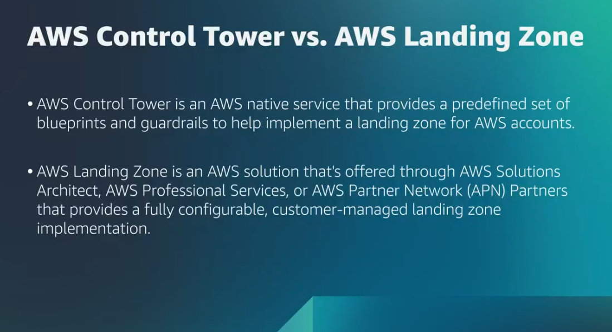

# Coursera: Migrating to the AWS Cloud: Another Way to Migrate

See https://www.coursera.org/learn/aws-fundamentals-migrating-to-the-cloud/lecture/Wmn27/another-way-to-migrate.

## Another Way to Migrate

**AWS Migration Competency Partners** have witnessed thousands of organizations migrate to the cloud, with a proven approach to achieve business goals faster. They can help provide customized knowledge, advise in decision making, assist in training necessary personnel, provide useful software and services, and so much more. They can also provide guidance and assistance with modernizations and optimizations.

AWS Partners provide assistance methods including:

* Case studies
* Whitepapers
* Ebooks
* Webinars

This information can be found in AWS Prescriptive Guidance and AWS Partner content pages.

## AWS Management and Governance

It's important to ensure that all migrated components are standardized in the way they are created. If you don't set and enforce standards, you're going to cause monumental problems for yourself.

There are three categories of tools to talk about:

* **Enabling category**: These give your users an environment in which they can create the architecture that they need, inside of a standardized standbox that's provided to them.
  * **AWS Control Tower**:
    * Allows you to easily set up multiple AWS accounts with guardrails on each account.
    * Automatically creates a logging and auditing account to keep track of what you're building.
    * Enforces built-in best practices (preventing users from disabling CloudTrail or deleting logs; ensuring that your RDS databases are encrypted)
    * Makes the review process more user-friendly by ensuring that rules are built-in.
* **Provisioning category**: These tools help to build out the architecture.
  * **CloudFormation**:
    * Allows to write infrastructure as code (IaC).
    * Writing instructions to be passed through the CloudFormation Engine, and CloudFormation makes the AWS API calls on your behalf.
    * Easily standardize what your architecture should look like.
    * Setting up **Service Catalog** makes it easier for users to provision recommended resources.
* **Operating category**: These give you a hand in automating and controlling running architecture.
  * **AWS Systems Manager**:
    * Simplifies updating and deploying to many EC2 instances across the board.
    * Includes **Amazon CloudWatch** for monitoring, logging, and alerting.
    * Helps you determine how your application is performing, both during and after the migration has completed.

## Getting Ready to Migrate

**AWS Landing Zone** provides a way for customers to set up secure, multi-account AWS environments. It can also provide a baseline environment to get started with a multi-account architecture, identity and access management, governance, data security, network design, and logging.

**AWS Control Tower** provides the easiest way to set up and govern as a secure multi-account AWS environment, aptly referred to as a landing zone. Your landing zone is created using AWS Organizations, which helps to bring ongoing account management and governance, as well as implementation best practices. Within Control Tower, builders can provision new AWS accounts in a few clicks, and your policies ensure that the accounts conform to company standards.

So AWS Control Tower is a self-service solution, which AWS Landing Zone is a customizable solution.

## Next

https://www.coursera.org/learn/aws-fundamentals-migrating-to-the-cloud/lecture/q07wa/what-is-migrate-and-modernize
